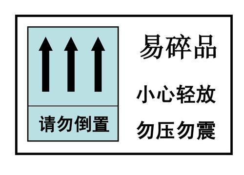
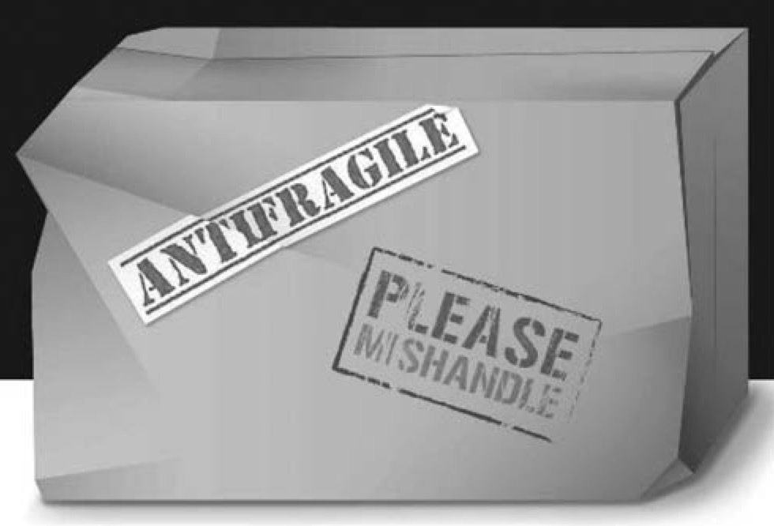

《反脆弱》是很有启发意义的一本书，作者纳西姆以提出"黑天鹅"
闻名，并在多次市场崩盘中获利颇丰。 相较之下，"反脆弱"的概念
则显得陌生而拗口，纳西姆用一个例子来描述该概念：

假设你去邮寄一箱香槟酒作为礼物。为避免包裹在运输途中受损，你通常会在箱子上写上
“易碎”、"小心轻放"。

那么“易碎”的反义词是什么?
几乎所有人都会回答，“易碎”的反义词就是“强韧”、“结实”，诸如此类。
但是强韧的物品虽不会损坏，但也不会变得更牢固，
从逻辑上说，具有“易碎”相反特性的包裹上应该标注“请乱扔乱放”的字样。
包裹里的东西不但不会受损，反倒能从各类撞击中受益。

这就是"反脆弱性"的含义：面对环境的破坏，反而能够从中受益，变得越来越好。
它超越了强韧性(robust)。
强韧性仅仅能让事物抵抗冲击;而反脆弱性则让事物在冲击中变得更好。

